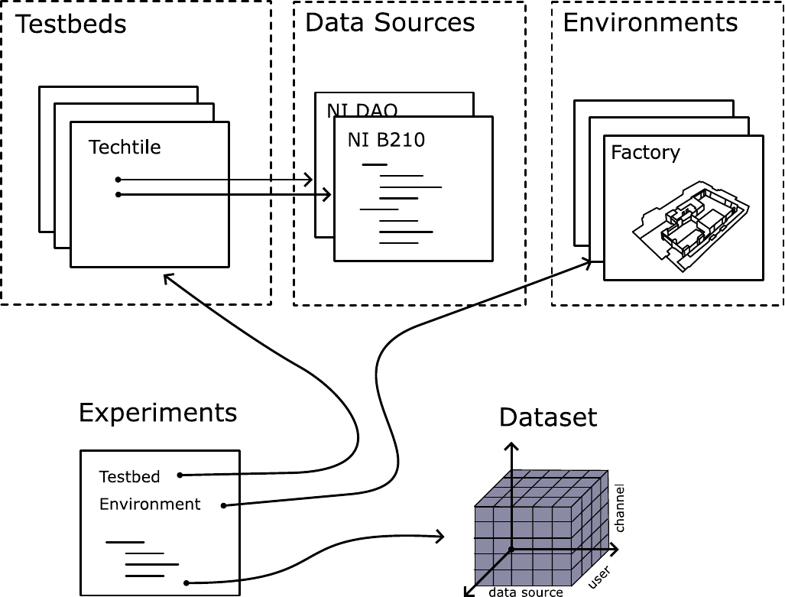

# Dataset Storage Standard (DSS)

## Summary 
This repository contains the description of a data storage standard in order to store and retrieve data in a standardized manner. 
It is instantiated primarily in the context of data storage of RF channel sounding, RF simulations, acoustic experiments, in order to conveniently store, exchange and access data.

The standard exists of human-readable files (YAML) describing the testbed and experiments, and a common data storage format.

### What is it

### What is it not

## Interface Description

The standard is divided in human-readable files, describing the testbed and experiments, a data storage format and an API. These are illustrated below:



Component overview:
- Environments (description)
- Testbed (description)
- Experiment (description)
- Data Source (description)
- Datasets
- API
  * Storage Location (URL/local)

A number of files are required in order to interpret and explain a conducted experiment. The files are structures such that reuse is possible among different experiments and testbeds. For instance, a data source can describe an SDR, as well as a DAQ system. A testbed exists out of several data sources. An experiment can make use of an environment file. The latter describes, e.g., the room dimensions and 3D scans. The experiment includes the testbeds used, a number of measurements each having different parameters. An example is provided below:

## Data Sources

### Types

- SDR: software-defined radio
- ADC/DAC: raw ADC/DAC measurement device
- VNA

```yaml
define &B210:
  name: "B210"
  type: "SDR"
  min_freq: 70E6
  max_freq: 5E9
  min_BW: 250E3
  max_BW: 40E6
  num_channels: 2 
```

## Testbed Description file

While not required, we suggest adding your testbed description files in [the following repository](https://github.com/6G-Testbeds/Testbed-Description-Files).
Below are some examples and the YAML schema to make your own testbed description file.

## Experiment Description file
```yaml
name: "same name as file"
description: "Describing the file"
testbed: *ref_testbed
scenarios:
 - data_source: #optional list of data_source indexes
   data_source_type: "SDR"
   sampling_rate: 250e3
   domain: "freq"
   freq: 433e6
   pos_type: "GPS" # or relative
 - data_source_type: "ADC"
   sampling_rate: 10e3
```

per scenario described in the experiment description file, a new data set is stored with the samen name as the experiment file including a postfix 01,02,03,...

## Dataset


The description files are utilized when reading/storing the data in a common format. A simple data set structure is used to store the data\footnote{Note, that we do not impose where the data is stored. } of a specific experiment scenario. A tensor is used with the following dimensions:
- data source
- data
- channel (optional)
- time (optional)
- user (optional)
- positions (optional)
Each dimension can have a coordinate associated to it, i.e., each dimension can have label-based indexing through coordinates. For example, for each position entry in the tensor, a position, e.g., relative or GNSS-based, can be associated with it.

The data types should be inferred from the dataset and is not imposed by the standard. The timestamp could be inferred from the \verb|start_time| in the experiment description file, but this is not required. Based on the start time and the sampling rate, the timestamps can be generated. The channel dimension indicates which channel of the data source is used. For example, some SDR have multiple RX chains on the same SDR board, and each RX chain is seen as a separate channel. The position of the user can be included in the dataset or in the scenario file, depending on the user's mobility, for instance. If the user is fixed during the scenario, it should be included in the scenario description, otherwise, it can be included in the dataset.

The dataset is stored in an HDF5 to keep interoperability with a range of programming languages.

All metatadata required to interpret the dataset needs to be included in the dataset file.
Example, in xarray the `attrs` could contain the serialized yaml files as an ordered dictonary.

```python
# example pseudoscript to conform to DSS

# iq_data: a 4D numpy array of complex32 IQ data with dimensions, PxSxCxT (P being the number of positions, S the number of data sources, C the number of channels and T the sequence length)
# postions: 1D list of positions of length P
# start_time: time when the measurement started according the the experiment description
# sampling_rate: according the the experiment description

ds = xr.Dataset(dict(data={["data_source", "channels", "data"], iq_data}), coords=dict(start_time=start_time, position=)) #not finished
    

```

## API

Example usages:

### Plot the PDP for each user position
```python
experiment = load("meas.yml")
scenarios = experiment.get_scenarios()

for sc in scenarios:
    grouped_ds = sc.get_ds().groupby("position")
    for ds in grouped_ds:
        utils.plot_pdp(ds)
```

## Uses of the DSS
-


